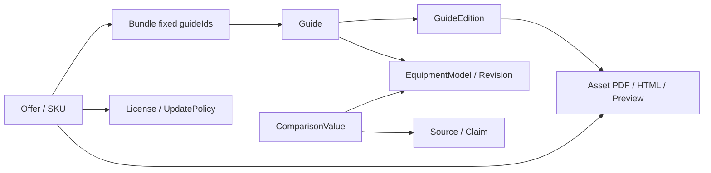
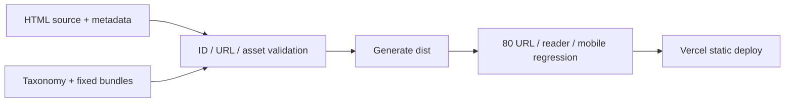

# Library Platform Roadmap — 전문 오디오 지식상품 플랫폼 설계

설계일: 2026-10-01. 대상은 현재 bluegee-library-site의 오디오 가이드 80종이다. 감사와 설계만 완료했으며 아래 기능은 구현하지 않았다.

## 1. 방향과 최종 정보 구조

BlueGEE Audio Library의 중심은 오디오 장비를 이해하고 선택·운용하는 전문 지식상품이다. 기존 80개 HTML의 독서 경험을 기반으로 Library → Product Detail → Bundle / Format 선택의 판매 정보 구조를 추가한다.

과도한 배너·큰 박스·불필요하게 빈 화면을 피하고 현재의 보통 크기 목록과 내부 어두운 목차를 유지한다. 홈페이지가 단순 자료 목록에서 구매 범위를 이해할 수 있는 판매 허브로 성장하도록 한다.

```text
Home / Library                    80종 탐색, 목적·번호·브랜드·종류·시리즈 필터
├─ Series                         Classic 50 / Deep Dive 10 / Microphone 20
├─ Product Detail                 범위·커버·목차·미리보기·형식·판본·관련 가이드
│  └─ Existing HTML reader        기존 guides 경로와 내부 목차 그대로
├─ Bundles                        Classic 50 / Deep 10 / Mic 20 / Complete 80
├─ Comparison                     마이크·프리앰프·컴프레서·채널스트립 모델 비교
├─ Search                         목적·원리·브랜드 계보·모델 별칭에 따른 탐색
└─ BlueGEE Research / About        편집·출처·정정 정책과 실제 공개 가능한 연구 근거
```

구매 이력·유료 다운로드·조직 라이선스 영역은 나중에 별도로 추가한다. 지금 로그인·결제·AI API·Supabase를 필수 기반으로 도입하지 않는다.

## 2. P0 — 지금 바로 개선

| ID | 작업 | 변경 범위 | 완료 기준 |
|---|---|---|---|
| P0-1 | 80개 상품 마스터 메타데이터와 자동 카탈로그 | 메타데이터·검증·생성 계층부터 | 무누락·무중복; 80개 URL과 2,087개 목차 보존; 수량 자동 생성 |
| P0-2 | 시리즈와 장비 분류 분리 | P0-1의 필드 설계 | 번호 시리즈50/10/20, 현재 탐색49/10/21; 050을 두 기준에 정확히 반영 |
| P0-3 | 기본 다중 키워드·별칭 검색과 세부 필터 | 기존 목록에 작은 필터 추가 | 브랜드·종류·용도·번호·시리즈 근거 확인; 기존 검색 유지; 검색 상태 URL 저장 |
| P0-4 | 출처 URL 확인·숨겨진 낡은 참조 정비 | 확인된 부분만 | HEAD만으로 삭제 금지; 실제 출처 대조 후 복구; 공개 80개 URL 그대로 |
| P0-5 | 072 좁은 화면·목차 포커스·번호 대비 | 국소 수정 | 표는 컨테이너 내부 스크롤; 장 선택 후 포커스 본문/버튼; 작은 텍스트 대비 개선 |
| P0-6 | 정적 목록·sitemap·canonical·공유 정보 | 생성된 HTML/메타데이터 | JS 없이 80개 링크; 유효 경로만 sitemap 등록; 정확한 canonical |
| P0-7 | GitHub/Vercel 배포 경로 문서화·등록 검증 | 실제 저장소 확인 후 | source/output 분리; 내부 감사 자료 공개 제외; 081 등록 절차 재현 가능 |

P0의 기준은 탐색성과 구조다. 전체 디자인 변경이나 결제 정책 확정은 필요하지 않다. 기술 수치의 전수 사실 검증은 별도 편집 작업으로 다루며 UI 교체와 한 작업으로 묶지 않는다.

## 3. P1 — 판매 준비

| ID | 작업 | 완료 기준 |
|---|---|---|
| P1-1 | Product Detail 정적 소개와 선별 미리보기 | 전체 공개 HTML과 미리보기 라벨 구분; 범위·대상·장 수·판본·관련·포함 번들 일치 |
| P1-2 | 대표 유형의 PDF 편집·검수 후 시리즈 확장 | 실제 페이지·표·도식·폰트·북마크 검수; 파일이 있을 때만 제공 가능 표시 |
| P1-3 | 네 번들·개별 상품·포맷별 오퍼 데이터 | 50/10/20 합계80; 제공 파일·겹치는 내용·언어·판본 명시; 가격 미정이면 draft |
| P1-4 | 라이선스·업데이트·영어판 정책과 Asset 모델 | 미출시 언어·형식 상태 정확; 구매 범위 보존 |
| P1-5 | 판매판 편집 품질과 브랜드 리서치 설명 | 공식 사양·시뮬레이션·실측·의견 구분; 강한 단정 표현 검토 |
| P1-6 | 판매/다운로드 연결 전 납품 설계 | 저장·권한·주문·정책 구조 검토; 현재 단계에는 결제·로그인 구현 없음 |

## 4. P2 — 플랫폼 확장

| ID | 작업 | 선행 조건 |
|---|---|---|
| P2-1 | Comparison 모델·리비전 단위 비교 | 출처·조건·단위가 검증된 사양; 가이드 수와 물리 장비 수 구분 |
| P2-2 | 목적 검색 고도화·선택형 의미 검색 | 안정 태그·별칭·관계·실제 검색 질문; 결과에 근거 ID 제공 |
| P2-3 | 영어판·판본 업데이트·추가팩 | 언어별 검수·출시 정책·manifest; Complete80 고정 구성 보존 |
| P2-4 | 구매 권한·조직/교육 납품·라이선스 관리 | 실제 상품과 납품 정책 확정 및 별도 구현 승인 |
| P2-5 | 고객 즐겨찾기·최근 자료·기기 간 기록 동기화 | 수요 확인; 현재 장별 localStorage 읽음 표시 계속 동작 |
| P2-6 | 공개 측정과 제품 개발 리서치 포트폴리오 | 측정 파일·조건·모델·판본·재현 방법 확보 |

P2는 사용자 수 자체가 기준이라기보다 데이터 품질과 수요가 확인된 뒤 확장하는 단계다. 실제 판매를 연결할 때 서버 권한·결제 등은 별도 범위를 정하고 우선순위를 재평가한다.

## 5. 데이터 모델 — 이번에는 설계만

| 엔티티 | 주요 필드 | 역할 |
|---|---|---|
| Guide | id, number, title, summary, seriesId, brandIds, equipmentModelIds, equipmentTypeIds, useCaseIds, topicIds, relatedGuideIds, legacyUrl, chapterRefs, publishedAt, updatedAt, status | 편집 내용의 안정 단위; PDF/HTML 이중 등록 방지 |
| Series | id, label, description, displayOrder | Classic/Deep/Microphone 시리즈; 폴더와 분리 |
| Brand | id, label, aliases, parentBrandId | 한영·약칭 검색; 역사적 제조사와 현행 제조사 구분 |
| EquipmentModel | id, brandId, name, aliases, typeIds, revisionIds | 한 가이드의 여러 장비를 분리; 비교의 단위 |
| EquipmentRevision | id, modelId, name, era, scopeEvidence | 생산기·하드웨어·플러그인 확장 기능의 혼합 방지 |
| Taxonomy | typeId/useCaseId/topicId, label, aliases | 장비 타입·소스 용도·원리/주제 분리; 공통 사전 |
| GuideEdition | id, guideId, editorialVersion, locale, releaseDate, changeSummary, reviewState, sourceRefs | 문서v4와 장비 리비전 별도; 개정일·감사일 구분 |
| Asset | id, editionId, format, status, publicUrl/privateStorageRef, bytes, sha256, pageCount, chapterRefs, deliveryMode | PDF/온라인HTML/오프라인HTML/커버/미리보기; 파일 상태 정확히 관리 |
| Offer/SKU | id, guideIds/bundleId, assetIds, locale, editionScope, licensePolicyId, updatePolicyId, price, currency, status | 판매 구성과 형식·이용 범위; 가격은 현재 null |
| Bundle | id, label, edition, guideIds, expectedCount, manifestHash, status | 출시 시 고정 구성; 마이크20과 탐색21 구분 |
| Source/Claim | id, url, title, publisher, checkedAt, httpMethod/httpStatus, modelScope, claimType, verificationState | 출처 재확인과 주장 근거; HTTP200은 기술 검증을 뜻하지 않음 |
| ComparisonValue | modelRevisionId, fieldId, value, unit, conditions, sourceId, verifiedAt, comparability | 같은 조건일 때 비교; 미확인 값 null |
| License/UpdatePolicy | id, allowedUse, seats, organizationScope, redistribution, term, newGuideRule, languageRule | 실제 정책 별도 확정; isPremium 하나로 대체 불가 |
| FutureOrder/Entitlement | orderId, customerRef, offerId, guide/edition/assetScope, licenseId, validity | 향후 서버 권한 단위; 지금 DB·로그인 구현하지 않음 |

Guide→GuideEdition→Asset, Guide→EquipmentModel→EquipmentRevision, Offer→Asset/Bundle/Policy, Bundle→GuideIds, ComparisonValue→Revision+Source로 관계를 구성한다. 동일 장비를 다루는 가이드가 여러 개라도 가이드 ID를 합치거나 자료를 삭제하지 않는다.



### 050 메타데이터 예 — 설계용 초안

```json
{
  "id": "audio-050",
  "number": "050",
  "title": "Neumann U 47",
  "seriesId": "classic-studio-gear",
  "equipmentCategoryId": "microphone",
  "equipmentTypeIds": [
    "tube-condenser"
  ],
  "brandIds": [
    "neumann"
  ],
  "legacyUrl": "guides/microphone/050_BLUEGEE_NEUMANN_U47_MASTER_GUIDE_v4.html",
  "useCaseIds": [
    "vocal",
    "drums",
    "guitar"
  ],
  "metadataReviewState": "draft",
  "editions": [
    {
      "id": "audio-050-v4-ko",
      "locale": "ko",
      "editorialVersion": "v4"
    }
  ],
  "assets": [
    {
      "format": "online-html",
      "status": "public",
      "url": "guides/microphone/050_BLUEGEE_NEUMANN_U47_MASTER_GUIDE_v4.html"
    },
    {
      "format": "pdf",
      "status": "planned",
      "url": null
    }
  ]
}
```

예시 용도는 편집 초안이며 성능 추천이 아니다. 실제 chapterRefs는 인벤토리에서 그대로 참조한다. asset의 editorialVersion은 문서의 편집판이며 U47 하드웨어 리비전을 의미하지 않는다.

현재 비운영 JSON은 감사 스냅샷이다. 위 모델을 적용한 운영 데이터로 자동 전환하지 않았다. 브랜드·용도·연관 관계의 초안에는 reviewState와 근거를 보존해야 한다.

## 6. Content Update System — 콘텐츠+metadata 등록

권장 저장소 구조이며 아직 구현하지 않았다.

```text
content/
  guides/001-...html ... 081-...html
  metadata/001.json ... 081.json
  taxonomy/brands.json types.json uses.json series.json
  bundles/*.json
scripts/
  validate-content.*
  build-library.*
dist/                           공개 정적 산출물
docs/                           편집·감사·출시 문서; 공개 산출물 제외
```

1. 작성자가 HTML과 해당 metadata 하나를 추가한다. 기존 태그·브랜드를 사용하는 자료는 다른 화면 파일을 수동 수정하지 않는다. 새로운 브랜드나 분류 자체가 생기면 사전 등록이 필요할 수 있다.
2. 검증기는 안정 ID·번호·URL 중복, 원본 파일·목차 ID·태그 참조, 발행/Asset 상태, 번들 멤버를 검사한다.
3. 생성기는 기존 schema의 catalog.js, 정적 목록, 카테고리·시리즈 수량, 상품 소개, 관련 자료, 검색 인덱스와 sitemap을 같은 원천에서 산출한다.
4. 생성 후 기존 80개 URL·목차·reader 리다이렉트·모바일·상호작용을 회귀 검증한다. 파일명 v4만으로 검수 통과를 표시하지 않는다.
5. Vercel은 검증을 통과한 dist만 공개한다. 실제 GitHub 구조와 Vercel 설정을 확인한 뒤 빌드 명령과 Output Directory를 맞춘다. 계정 설정은 이번에 확인하지 못했고 설정 파일도 만들지 않았다.



현재 GitHub에 dist 내용이 루트로 올라간 배포를 갑자기 source 구조로 바꾸지 않는다. 후속 이행 때 현재 배포 루트를 확인하고 새 빌드 산출물의 80개 공개 경로가 일치하는지 검증한다. 감사 문서와 내부 JSON을 운영 웹 루트에 올리지 않는다. 정적 프로젝트도 Framework Preset·Root·Output은 실제 저장소 구조에 맞춰야 한다. [Vercel 빌드 설정 문서](https://vercel.com/docs/builds/configure-a-build).

081을 추가하면 Library·검색·카테고리·상품 소개·관련 자료에는 자동 반영한다. 기존 Complete80의 구매 manifest는 그대로 보존하고 새 판본이나 추가팩은 별도 정의한다. ‘현재 라이브러리 전체’와 ‘구매한 고정판80’은 서로 다른 집합이다.

## 7. Library / Search / Related 설계

필터는 독립적인 번호 범위·시리즈·브랜드·장비 종류·용도다. 현재 category URL은 호환한다. 필터의 교집합을 계산하고 결과 수·전체 초기화·검색 상태 URL을 제공한다. 번호의 0 패딩, 모델 하이픈, 한영 제조사 표기를 정규화한다.

검색 인덱스는 제목·번호·브랜드/모델 별칭·시리즈·장비 종류·용도·주제·짧은 범위 설명을 우선 저장한다. 전체 목차·장내 본문은 별도의 장 인덱스로 연결해 홈의 초기 payload를 줄인다. 현재 각 가이드의 장내 검색은 유지한다.

목적 질문은 우선 태그 교집합으로 풀고 매칭 근거와 가이드 번호를 표시한다.

- ‘보컬용 진공관 마이크’ → vocal + tube-condenser.
- ‘Neve 계열 프리앰프’ → 검수된 Neve 브랜드 계열 + preamp.
- ‘록드럼 컴프레서’ → drums + compressor + 검수된 rock 태그.

rock 태그가 없으면 ‘드럼용 컴프레서’로 넓힌 결과임을 설명할 수 있으나 장르 검증을 한 것처럼 표시하지 않는다. 현재 결과0이라는 사실만으로 모든 드럼 관련 가이드에 rock을 자동 부여하지 않는다. Neve 가이드에 컴프레서도 포함돼 있으므로 브랜드 단어만으로 전부 프리앰프 결과에 넣지 않는다.

초기 목적 검색은 AI API가 없어도 구현할 수 있다. P2에서 의미 검색을 도입하더라도 가이드·장·태그·출처 ID를 기반으로 추천 이유를 설명하고, 자료에 없는 음색·수치·성능 우위를 생성하지 않는다.

관련 자료는 ① 수동 편집된 기본편/심층편 관계 ② 같은 브랜드 ③ 같은 용도 ④ 같은 장비 종류의 순서로 정렬한다. 추천에 관계 이유를 표시한다. 같은 브랜드의 EQ와 컴프레서를 같은 모델로 취급하지 않는다. 한국어 별칭 예시는 Neve/니브, Neumann/노이만, compressor/컴프레서, preamp/프리앰프이며 공통 용어 사전에서 관리한다.

## 8. Comparison 단계의 자료 원칙

| 분야 | 비교 데이터 초안 | 검증 조건 |
|---|---|---|
| 마이크 | 지향성·트랜스듀서·감도·노이즈·SPL·전원·거리 운용 | 모델/리비전·PAD·THD·패턴·단위·출처 일치 |
| 프리앰프 | 입출력·회로·게인·헤드룸 | 부하·측정 주파수·단위·입력/출력 조건 확인 |
| 컴프레서 | 원리·시간 상수·비율·사이드체인 | 세대·설정·신호 의존 동작·하드웨어/플러그인 구분 |
| 채널스트립 | 섹션 구성·라우팅·EQ·Dynamics·입출력 | 장비 구성과 옵션을 분리; 단일 컴프레서와 동일 상품으로 취급하지 않음 |

숫자는 공식 자료나 실제 측정 근거에 연결하고 다른 모델·리비전·하드웨어/플러그인을 섞지 않는다. 교육용 곡선과 가상 기록을 실측 행에 복사하지 않는다. 같은 조건이 아니면 ‘직접 비교 불가’로 표시한다. Comparison UI는 P2에서 데이터 검수 후 구현한다.

## 9. 브랜드·상품·독서 화면의 역할

브랜드 홈과 상품 소개는 편집 전문성, 출처 대조 방법과 업데이트 책임을 보여 준다. 본문은 원리·운용·비교·기록에 집중한다. BlueGEE 자체 개발 메모와 미확인 내부 측정 주장을 다시 본문에 넣지 않는다.

제품 개발 역량은 별도 Research 페이지에서 실제 공개 가능한 코드·측정 조건·데이터·재현 방법으로 제시한다. 현재 가이드가 자사 플러그인 성능을 실측 검증했다고 말하지 않는다. 현재 자료의 근거 수준을 유지하면서 편집 품질과 분석 능력을 브랜드 자산으로 만든다.

## 10. 회귀와 단계 완료 기준

P0 구현 전에 dist86 파일·80개 URL·2,087개 목차 ID baseline을 보관한다. 구현 후 다음을 확인한다.

- 번호 무누락·무중복, 기존 path와 유효 hash 보존.
- 050 마이크 분류와 판매 시리즈 소속을 각각 유지.
- chapter·이전/다음·장내 검색·localStorage·workbench 기능 유지.
- reader 호환, 상단 헤더와 내부 어두운 목차 하나 유지.
- 홈과 가이드의320/390/768/1440px 표시 및 키보드 이동 확인.
- 기존 자료 내용에 의도하지 않은 변화가 없음.

정상 동작하는 옛 코드는 신규 셸의 의존성을 확인하기 전에 일괄 삭제하지 않는다. P1 상품 출시는 실제 PDF/HTML Asset·preview·bundle manifest·정책·상품 문구가 일치하는지 검토한 뒤 결정한다. 현재 웹 전체 공개를 프런트 조건문으로 유료화하지 않는다.

P2 비교·조직 권한·의미 검색은 선행 데이터와 운영 조건이 마련될 때 실행 범위를 다시 정한다. 서버·결제 선택을 이번 감사에서 강제하지 않는다.

## 11. 첫 구현 기능 하나

**80개 상품 마스터 메타데이터 기반 자동 카탈로그.**

브랜드·종류·용도·시리즈의 근거를 정리하고 새 자료 하나를 콘텐츠+metadata로 등록할 수 있게 하는 기능이다. 수동 수량과 여러 화면의 등록 정보를 한 원천으로 만들어야 검색·상세·번들이 같은 상품을 가리킨다.

최소 구현은 현재 UI·본문·파일 URL을 보존하고 metadata 검증·생성과 호환 catalog.js에 집중한다. 필터 확장과 상품 상세는 별도 후속 단계로 진행해 변경 범위를 좁힌다. 이번에는 비운영 인벤토리와 이 계획까지만 작성했다.

다음 Codex 명령 초안:

> 감사 문서를 기준으로 P0-1 상품 마스터 메타데이터와 등록 검증·기존 catalog.js 자동 생성만 구현하세요. 현재 80개 가이드 본문과 파일 URL, 2,087개 목차 ID, 내부 어두운 독서 화면, reader 호환을 보존하세요. 시리즈는001–050 /051–060 /061–080으로 나누고 050U47의 장비 분류는 마이크로 유지하세요. 브랜드와 용도 태그 초안에 검수 상태와 근거를 보관하세요. 홈 수량을 같은 메타데이터에서 생성하고 새081은 HTML+metadata 추가로 등록되게 하세요. 결제·로그인·PDF 변환·대규모 UI 변경은 포함하지 마세요. 구현과 회귀 검증을 보고한 뒤 배포 전에 멈추세요.

이번 감사 보고 이후에는 사용자 확인 전 다음 구현을 시작하지 않는다.

## P0-1 구현 기록 — 2026-10-01

이번 추가 기록은 앞의 감사/설계 스냅샷을 보존하면서 실제 구현 상태를 구분한다. 상품 원본은 `content/products.json` 한 파일이며, 현재 정적 HTML·JavaScript 구조에 맞춰 JSON을 선택했다. JSON Schema와 파일·목차·참조 검증을 통과하면 `dist/catalog.js`, `dist/products.json`, `dist/index.html`, `dist/app.js`, `dist/catalog-core.js`를 생성한다. 마스터나 템플릿을 수정한 뒤 `npm run build`를 실행한다. 생성 파일을 직접 수정하지 않는다.

80개 상품의 ID·번호·slug·제목·브랜드·시리즈·category·subcategory·equipmentType·설명·검색어·HTML/PDF/커버·상태·추천·관계·번들·날짜를 관리한다. 확인할 수 없는 PDF·커버·편집 날짜는 null, 미확정 관련 자료는[]다. 번호 기준 시리즈50/10/20과 현재 탐색49/10/21을 분리했다.050U47의 기존 마이크 경로·분류를 보존했다.

현재 홈페이지는 기존 디자인을 유지하면서 브랜드·시리즈만 작은 메타 정보로 표시한다. 제목·브랜드·장비 종류·분류·검색어 검색과 All/카테고리 필터가 마스터에서 동작한다. Brand/Equipment Type은 조회 API와 facets 구조를 준비했다. `getProductDetail`은 같은 데이터로 ID·번호·slug 조회를 지원한다. 새 판매용 상세 화면은 만들지 않았다. 원래 `reader.html?id=002&chapter=tab-history` 호환 어댑터도 생성한다.

실제 브라우저에서80개 자료 링크,2,087개 공통 목차,검색·필터·홈320/390/768/1440px·대표 독서 모바일·읽음 표시를 확인했다. 임시081을 격리된 데이터/폴더에 추가해 전체81·아웃보드50·검색·상세 조회·읽기를 확인한 뒤 제거했다. 최종 마스터는80개다. lint/typecheck/validate/build/build:check와7개 테스트를 통과했다.

원래80개 가이드, styles.css, reader.html, reader.js는 변경하지 않았다. 기존 감사의 외부 출처/숨겨진 옛 참조/072 표·포커스 결함은 이번 구현에서 해결했다고 주장하지 않는다. 로그인·결제·Supabase·AI API·PDF 제작·GitHub push·Vercel 배포를 수행하지 않았다.

신규 추가의 정확한 절차와 스키마,향후products/bundles/users/purchases/entitlements 이전 방향은 [CATALOG_MAINTENANCE.md](CATALOG_MAINTENANCE.md)를 참조한다. 기존 80종 고정 번들은 planned이며,081 추가만으로 Complete80 구성에 자동 편입하지 않는다. JSON과 DB의 이중 원본을 만들지 않고 이전 시점에 원본을 명확하게 전환한다.

다음 구현 후보는 기존 읽기 링크를 보존하는 **상품 상세 소개 화면** 하나다. 이번에는 해당 화면의 데이터 조회 구조까지만 준비했다.

## 상품 상세 소개 단계 완료 — 2026-10-01

사용자 승인에 따라 공통 소개 화면을 구현했다. `products.json` → 동일 상세 조회 → `product.html?id=audio-...` 구조이며 새 상품은 HTML+마스터1객체+빌드만으로 연결된다. 상품별 화면이나 별도 상세 데이터를 추가하지 않는다. 원본 읽기·목차·URL은 유지하고 검색 목록 상태를 복원한다. 이전/다음은 공개 번호순, 관련 자료는 명시 relatedIds만 사용한다.

선택 highlights/whyItMatters는 같은 마스터에서 편집한다. 기본값은 실제 목차와 기존 설명이다. 모바일/데스크톱 대표5종의4폭,80개 상세·80개 원본·2,087개 목차,임시081 자동 상세·9개 테스트와 lint/typecheck/build를 통과했다. 기존 정상 목록·검색·필터·원문 reader 기능과050분류를 보존했다. 근거와 변경 파일: [PRODUCT_DETAIL_IMPLEMENTATION.md](PRODUCT_DETAIL_IMPLEMENTATION.md).

다음 구현 후보 하나는 **브랜드 필터 UI**다. 이미 있는 facets와 조회 API에 작은 탐색 컨트롤을 연결할 수 있다. 이번에는 여기서 멈춘다. PDF 제작·판매·로그인·즐겨찾기·자동 추천·결제·Supabase·AI API는 이 단계에 포함하지 않았다. 배포도 진행하지 않았다. SEO용 상품별 정적 페이지와 OG/canonical은 추후 승인 범위에서 같은 마스터로 설계한다.
